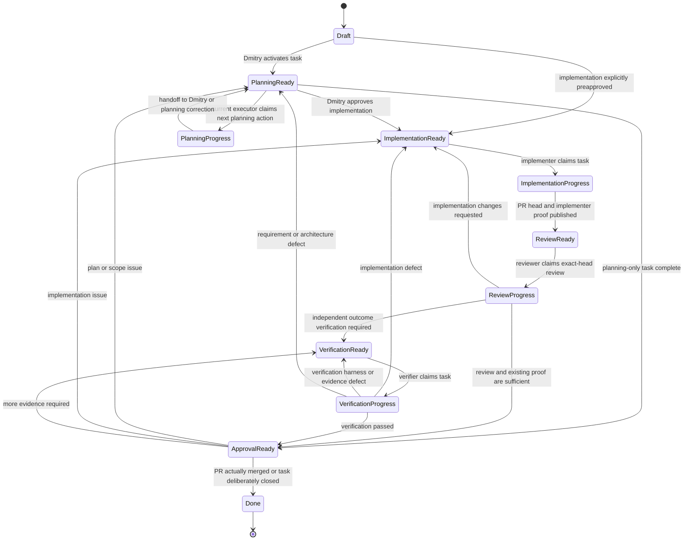

# Task lifecycle

The lifecycle separates **what kind of work is next** from **whether that work can run now**. It is provider-neutral: the
same model applies to ChatGPT, Codex Cloud, Local Codex, IDE-hosted agents, and humans.

## Fields

### Phase

- `Draft` — captured but not activated.
- `Planning` — refine outcome, decisions, non-goals, proof, implementation route, and verification route.
- `Implementation` — change the repository and produce implementer-owned proof.
- `Review` — inspect the code, scope, tests, review threads, and exact-head CI evidence.
- `Verification` — validate the observable result in a representative environment.
- `Approval` — Dmitry performs final human acceptance and decides whether to merge or close.
- `Done` — the PR was actually merged or the task was deliberately closed with rationale.

### Status

- `Ready` — the next action in the current phase can start now.
- `In progress` — a concrete actor owns and is performing the next action, including waiting for checks that actor started.
- `Blocked` — the next action cannot continue without an external decision, permission, service, credential, or capability.

`Review` is a phase, not a status: it is substantive work with its own actor, inputs, outcomes, and correction transitions.
`Blocked` is a status, not a phase: preserving the current phase records where work should resume after the blocker clears.

`Draft` and `Done` do not need a status. They are lifecycle endpoints outside the claim loop.

## Planned routing and current ownership

Planning chooses future roles before those phases begin:

- `Implementer` — executor selected for the `Implementation` phase.
- `Verifier` — executor responsible for coordinating the `Verification` phase and its evidence.

Current routing is materialized separately:

- `Executor` — product/runtime expected to perform the **next current action**.
- `Assignee` — concrete GitHub identity or human responsible for that action.
- `Worker reference` — concrete chat, task, process, worktree, branch, or PR ownership record after claim.

Keeping both planned and current routing is intentional. `Implementer` and `Verifier` are decisions made during Planning;
`Executor` lets every dispatcher use the same query for the current phase without reimplementing transition logic.

Transition invariants include:

```text
Planning -> Implementation: Executor := Implementer
Implementation -> Review: Executor := ChatGPT (default reviewer)
Review -> Verification: Executor := Verifier
Review/Verification -> Approval: Executor := Human
```

A repository may override the default reviewer explicitly, but formal GitHub review still requires an identity independent
from the PR author.

## Ready semantics

`Ready` means: **the next action in the current phase is ready for the current executor/assignee**. It does not mean only an
unassigned implementation queue.

### Pool Ready

A worker pool must claim the task:

```text
Phase: Implementation
Status: Ready
Implementer: Local Codex
Verifier: ChatGPT
Executor: Local Codex
Assignee: empty
```

After claim:

```text
Phase: Implementation
Status: In progress
Executor: Local Codex
Assignee: bedrin-codex-local
Worker reference: <task/process/worktree>
```

### Directed Ready

A known actor has a personal next action:

```text
Phase: Planning
Status: Ready
Executor: Human
Assignee: bedrin
```

This means the plan is prepared and Dmitry may review it. The task remains in Planning because implementation is not yet
authorized.

A phase may therefore contain several directed turns:

```text
Planning / Ready / ChatGPT
  -> Planning / In progress / ChatGPT
  -> Planning / Ready / Human
  -> Planning / Ready / ChatGPT   (changes requested)
  -> Implementation / Ready / Implementer   (approved)
```

The apparent `In progress -> Ready` transition is a handoff to the next actor in the same collaborative phase, not a reversal
of progress.

The same directed semantics apply to final acceptance:

```text
Phase: Approval
Status: Ready
Executor: Human
Assignee: bedrin
```

Dmitry may transition directly from that state to Done by actually merging/closing, or route the task back to Planning,
Implementation, or Verification. `Approval / In progress` is optional when he wants to signal that human review has started;
it is not required for a direct decision.

## Lifecycle



At any active phase, `Ready` or `In progress` may become `Blocked`. Clearing the blocker returns the task to `Ready` in the
same phase or a deliberately corrected earlier phase.

## Correction limits

Track substantive correction rounds separately from scheduler retries and infrastructure noise.

- Increment the implementation correction count when Review returns a real code/design defect to Implementation.
- Increment the verification correction count when outcome verification finds a real implementation defect.
- Do not increment for runner outages, transient network failures, or a retry of unchanged evidence.
- After two substantive unattended correction rounds, or immediately after a product/architecture reversal, re-baseline the
  authoritative issue and deliberately choose the next executor. Do not allow ten blind autonomous loops.

## Completion

There is no separate `Ready to merge` lifecycle phase. A task remains `Approval / Ready` until Dmitry accepts it and the PR is
actually merged (or the task is deliberately closed). Add a separate queue later only if approved-but-unmerged work becomes a
real operational backlog, such as a release train.