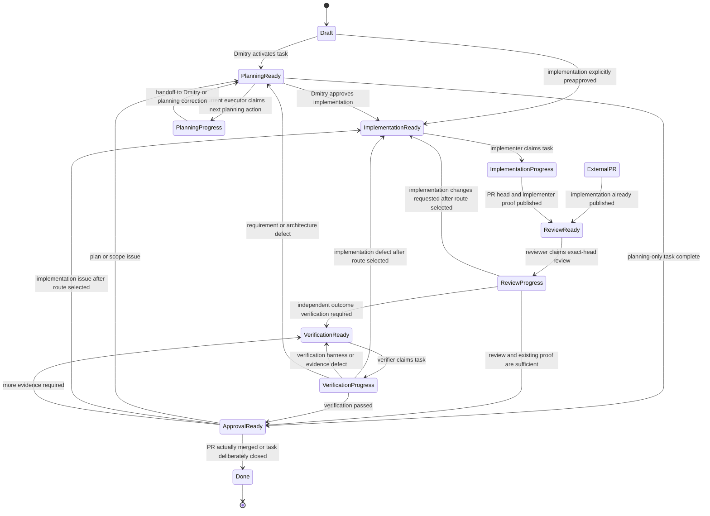

# Task lifecycle

The lifecycle separates **what kind of work is next** from **whether that work can run now**. It is provider-neutral: the
same model applies to ChatGPT, Codex Cloud, Local Codex, IDE-hosted agents, automation-authored pull requests, and humans.

## Fields

### Status

- `Draft` — captured but not activated.
- `Planning` — refine outcome, decisions, non-goals, proof, implementation route, and verification route.
- `Implementation` — change the repository and produce implementer-owned proof.
- `Review` — inspect the code, scope, tests, review threads, and exact-head CI evidence.
- `Verification` — validate the observable result in a representative environment.
- `Approval` — Dmitry performs final human acceptance and decides whether to merge or close.
- `Done` — the PR was actually merged or the task was deliberately closed with rationale.

### Execution

- `Ready` — the next action in the current status can start now.
- `In progress` — a concrete actor owns and is performing the next action, including waiting for checks that actor started.
- `Blocked` — the autonomous workflow cannot safely continue and requires Dmitry's decision or action.

`Review` is a lifecycle status, not an execution state: it is substantive work with its own actor, inputs, outcomes, and
correction transitions. `Blocked` is an execution state, not a lifecycle status: preserving the current status records where
work should resume after Dmitry clears the blocker.

`Draft` and `Done` do not need an execution value. They are lifecycle endpoints outside the claim loop.

Routine waiting is not `Blocked`. A worker waiting for CI, an already-dispatched agent, or another observable operation it owns
remains `In progress` and is monitored. Set `Blocked` only when the automation must stop, assign `Executor = Human` and
`Assignee = bedrin`, record the exact decision or action required, and notify Dmitry.

## Planned routing and current ownership

Planning chooses future roles before those lifecycle statuses begin:

- `Implementer` — executor deliberately selected for a future `Implementation` turn. This field is optional; empty means unknown,
  not applicable to the already-published change, or not yet deliberately routed.
- `Verifier` — executor responsible for coordinating `Verification` and its evidence.

PR authorship and automation identity are provenance in the pull request itself, not implicit routing values. External-PR intake
must not copy an author, bot name, or previously unseen provider into `Implementer` merely to populate the field.

Current routing is materialized separately:

- `Executor` — product/runtime expected to perform the **next current action**.
- `Assignee` — concrete GitHub identity or human responsible for that action.
- `Worker reference` — concrete chat, task, process, worktree, branch, PR, or tick ownership record after claim.

Keeping planned and current routing separate is intentional. Planning records `Implementer` only when an Implementation route is
needed, and records `Verifier` when Verification may be needed. `Executor` lets every dispatcher use the same query for the
current lifecycle status without requiring either planned field to be populated during unrelated statuses.

Transition invariants include:

```text
Planning -> Implementation: require non-empty Implementer; Executor := Implementer
Implementation -> Review: Executor := ChatGPT (default reviewer)
External PR intake -> Review: leave Implementer unchanged/empty; Executor := ChatGPT
Review -> Implementation: deliberately choose/set Implementer first when it is empty
Review -> Verification: Executor := Verifier
Review/Verification -> Approval: Executor := Human
```

A repository may override the default reviewer explicitly, but formal GitHub review still requires an identity independent
from the PR author.

## Ready semantics

`Ready` means: **the next action in the current lifecycle status is ready for the current executor/assignee**. It does not mean
only an unassigned implementation queue.

### Pool Ready

A worker pool must claim the task:

```text
Status: Implementation
Execution: Ready
Implementer: Local Codex
Verifier: ChatGPT
Executor: Local Codex
Assignee: empty
```

After claim:

```text
Status: Implementation
Execution: In progress
Executor: Local Codex
Assignee: bedrin-codex-local
Worker reference: <task/process/worktree>
```

### Directed Ready

A known actor has a personal next action:

```text
Status: Planning
Execution: Ready
Executor: Human
Assignee: bedrin
```

This means the plan is prepared and Dmitry may review it. The task remains in Planning because implementation is not yet
authorized.

A lifecycle status may therefore contain several directed turns:

```text
Planning / Ready / ChatGPT
  -> Planning / In progress / ChatGPT
  -> Planning / Ready / Human
  -> Planning / Ready / ChatGPT   (changes requested)
  -> Implementation / Ready / Implementer   (approved after Implementer is selected)
```

The apparent `In progress -> Ready` transition is a handoff to the next actor in the same collaborative lifecycle status, not a
reversal of progress.

The same directed semantics apply to final acceptance:

```text
Status: Approval
Execution: Ready
Executor: Human
Assignee: bedrin
```

Dmitry may transition directly from that state to Done by actually merging/closing, or route the task back to Planning,
Implementation, or Verification. `Approval / In progress` is optional when he wants to signal that human review has started;
it is not required for a direct decision.

## Pull-request-first entry

A work item may be an issue or a pull request. When Dependabot or another external actor already opened a reviewable PR, add the
PR itself to the Project and normally initialize it as:

```text
Status: Review
Execution: Ready
Implementer: empty
Verifier: <selected verifier>
Executor: ChatGPT
Assignee: bedrin-gpt
Worker reference: <PR URL and exact head>
```

The pull request records its actual author. Leaving `Implementer` empty means the delivery system has not selected an executor to
perform new implementation work; it does not lose provenance and does not prevent Review, Verification, Approval, rebase
monitoring, or closure.

This skips Draft, Planning, and Implementation only when the scope is understandable and no product, compatibility, security,
or policy decision is missing. Otherwise route the PR item to `Planning / Ready`.

An acceptable PR advances to Verification or Approval. A stale Dependabot head stays in Review while ChatGPT owns monitoring of
the bot rebase through `Executor` and `Worker reference`. A PR requiring repository-specific compatibility code becomes
`Review / Blocked`, assigns the next action to Dmitry, and links to a new issue routed through Planning and Implementation; that
linked work deliberately selects its own Implementer. The source PR remains the work item for the original proposal until
superseded or closed. See [`pull-request-intake.md`](pull-request-intake.md).

## Lifecycle



At any active lifecycle status, `Execution` may move between `Ready` and `In progress`. `Blocked` stops autonomous processing and
routes the next action to Dmitry. Clearing the blocker returns the task to `Ready` in the same lifecycle status or a deliberately
corrected earlier status.

## Correction limits

Track substantive correction rounds separately from scheduler retries and infrastructure noise.

- Increment the implementation correction count when Review returns a real code/design defect to Implementation.
- Increment the verification correction count when outcome verification finds a real implementation defect.
- Do not increment for runner outages, transient network failures, or a retry of unchanged evidence.
- After two substantive unattended correction rounds, or immediately after a product/architecture reversal, re-baseline the
authoritative issue and deliberately choose the next executor. Do not allow ten blind autonomous loops.

## Completion

There is no separate `Ready to merge` lifecycle status. A task remains `Approval / Ready` until Dmitry accepts it and the PR is
actually merged (or the task is deliberately closed). Add a separate queue later only if approved-but-unmerged work becomes a
real operational backlog, such as a release train.
