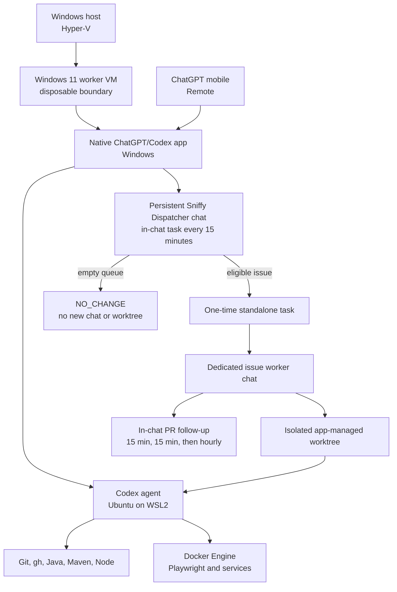

# Local Codex worker on a Windows virtual machine

This runbook describes an always-on local worker that can host Sniffy and other repositories, execute privileged,
long-running, or Docker-heavy tasks, and remain observable from the ChatGPT desktop and mobile apps. The security
boundary is a disposable Windows virtual machine; the native ChatGPT/Codex app runs on Windows while its Codex agent and
developer toolchain run in WSL2 inside that VM.

The design was last checked against the linked product documentation on 2026-07-26.

## 1. Architecture and decisions



The important choices are:

- Run the native ChatGPT/Codex desktop app on Windows because the app supplies local projects, worktrees, Scheduled tasks,
  review UI, and [Remote connections](https://learn.chatgpt.com/docs/remote-connections) from mobile.
- Configure the app's Codex agent and integrated terminal to use WSL2. Repository paths, Git, `gh`, Java, Maven, Node,
  Docker, and tests then stay inside Linux.
- Use one persistent **in-chat** Scheduled task as the dispatcher. Empty polling cycles return to that same chat and do
  not create Remote-chat or worktree clutter.
- For a real issue, let the dispatcher create one **one-time standalone** Scheduled task. That task creates one dedicated
  worker chat and one isolated worktree, making implementation easy to follow from desktop or mobile.
- Keep PR supervision in the same worker chat. The worker creates or updates an in-chat continuation task: first check
  after 15 minutes, second check 15 minutes later, then hourly until completion or a human decision.
- Do not use a recurring standalone dispatcher: it creates a new chat for every poll, including no-op polls.
- Do not use Python observers, shell UI automation, `codex app-server`, or nested `codex exec` for the app-native path.
- Treat the complete Windows VM as disposable and trusted by the agent. Full access is acceptable only because the VM has
  no host files, host credentials, or unrelated repositories.
- Use a dedicated GitHub identity and repository-scoped credentials. GitHub rulesets remain the final write boundary.
- Never merge or enable auto-merge without an explicit command from Dmitry.

This worker complements Codex Cloud. Route clean, bounded tasks to Cloud and use the local worker when persistent
artifacts, Docker, special networking, privileged tools, existing-branch surgery, or long debugging sessions matter.

## 2. Host and worker VM

### 2.1. Host requirements

The physical host must run a Windows edition that includes Hyper-V and have hardware virtualization enabled. Follow
Microsoft's [Hyper-V host requirements](https://learn.microsoft.com/en-us/windows-server/virtualization/hyper-v/host-hardware-requirements#operating-system-requirements)
and [nested virtualization](https://learn.microsoft.com/en-us/windows-server/virtualization/hyper-v/enable-nested-virtualization)
guidance.

Enable Hyper-V from elevated PowerShell and reboot:

```powershell
Enable-WindowsOptionalFeature -Online -FeatureName Microsoft-Hyper-V -All
```

Verify:

```powershell
systeminfo.exe
Get-WindowsOptionalFeature -Online -FeatureName Microsoft-Hyper-V-All
```

### 2.2. Recommended allocation

For a Ryzen 9 9900X host with 64 GB RAM, start with:

| Resource | Worker VM | Rationale |
| --- | ---: | --- |
| Virtual processors | 12 | Leaves half of the host's logical processors available |
| Memory | 32 GB static | Windows, WSL, Maven, Docker, and browser tests |
| System disk | 300 GB dynamically expanding | Tool caches, Docker layers, worktrees, and logs |
| VM generation | 2 | Windows 11 Secure Boot and virtual TPM |
| Network | Hyper-V Default Switch | NAT outbound access without host shares |

Use static memory initially because nested WSL and Docker are easier to reason about without two layers of dynamic
memory. Reduce concurrency before allowing the physical host to page.

### 2.3. Windows guest and licensing

Windows 11 Home supports WSL2, but Pro is recommended for administration and RDP. A permanent Windows guest requires a
license that permits the additional VM; the physical host license does not automatically license a second instance. The
official Windows 11 Enterprise Evaluation is suitable for proving the setup, but rebuild or assign a valid license before
its evaluation expires. Do not use activation bypasses or unofficial images.

Use the stable names `bedrin-worker-1`, `bedrin-worker-2`, and store them under `C:\work\vms\<name>`. Keep the official
installation image at `C:\work\iso\windows.iso`.

A reproducible first VM can be created from elevated PowerShell:

```powershell
$vmName = "bedrin-worker-1"
$vmRoot = "C:\work\vms\$vmName"
$isoPath = "C:\work\iso\windows.iso"

New-Item -ItemType Directory -Force -Path $vmRoot
New-VM `
  -Name $vmName `
  -Generation 2 `
  -MemoryStartupBytes 32GB `
  -NewVHDPath "$vmRoot\system.vhdx" `
  -NewVHDSizeBytes 300GB `
  -SwitchName "Default Switch"

Set-VMProcessor -VMName $vmName -Count 12 -ExposeVirtualizationExtensions $true
Set-VMMemory -VMName $vmName -DynamicMemoryEnabled $false -StartupBytes 32GB
Set-VMFirmware -VMName $vmName -EnableSecureBoot On -SecureBootTemplate MicrosoftWindows
Set-VMKeyProtector -VMName $vmName -NewLocalKeyProtector
Enable-VMTPM -VMName $vmName
Set-VM -Name $vmName -AutomaticStartAction Start -AutomaticStopAction Save
$dvd = Add-VMDvdDrive -VMName $vmName -Path $isoPath -Passthru
Set-VMFirmware -VMName $vmName -FirstBootDevice $dvd
```

Install Windows with a dedicated low-value local account. Do not add host drive sharing, a personal browser profile,
email, cloud drives, password managers, or employer credentials. Apply Windows Update, disable guest sleep, and create a
clean pre-credential checkpoint.

## 3. Install and constrain WSL2

Inside the Windows VM, use elevated PowerShell:

```powershell
wsl --update
wsl --list --online
wsl --install -d Ubuntu-26.04
wsl --set-default-version 2
```

If the Store path fails, retry with `--web-download`. Restart Windows, finish the Linux user setup, and verify:

```powershell
wsl --status
wsl --list --verbose
```

If nested virtualization is reported unavailable, stop the guest and run this on the physical host:

```powershell
Set-VMProcessor -VMName "bedrin-worker-1" -ExposeVirtualizationExtensions $true
```

Optionally reserve resources for the Windows app in `%USERPROFILE%\.wslconfig`:

```ini
[wsl2]
memory=22GB
processors=10
swap=8GB
```

Apply changes with `wsl --shutdown`. The outer Windows VM is the security boundary; WSL resource limits are not a
security boundary.

## 4. Install the desktop app and Remote

Install the current native Windows app inside the VM. Then:

1. Sign in with the same ChatGPT account and workspace used by the mobile app.
2. In **Settings**, switch the Codex agent from Windows native to **WSL** and restart the app.
3. Select WSL as the integrated terminal.
4. Add Sniffy from `\\wsl$\Ubuntu-26.04\home\<worker>\src\sniffy\sniffy` as a local project.
5. Use one app project per repository; do not point a project at a directory containing several repositories.
6. Select **Set up Remote** in the sidebar and pair the phone with the displayed QR code.
7. Enable launch at login, keep the Windows account signed in, and keep the app running.

The current app and WSL behavior are documented in [ChatGPT desktop app for Windows](https://learn.chatgpt.com/docs/windows/windows-app).
Remote host availability is documented in [Remote connections](https://learn.chatgpt.com/docs/remote-connections).

For unattended reboots, either log in manually after maintenance or use automatic login only for the dedicated low-value
worker account. Automatic login improves recovery but stores a reusable Windows credential inside the disposable VM.

## 5. Provision the WSL developer environment

Run all project tooling inside Ubuntu. Keep repositories under `~/src/<owner>/<repository>`.

Install shared packages and a version manager:

```bash
sudo apt-get update
sudo apt-get install -y \
  bash bubblewrap build-essential ca-certificates curl git jq tar unzip zip gh

curl https://mise.run | sh
echo 'eval "$(~/.local/bin/mise activate bash)"' >> ~/.bashrc
eval "$(~/.local/bin/mise activate bash)"
mise use --global node@24 maven@3.9
for version in 11 17 21 25; do
  mise install "java@${version}"
done
```

Install Docker Engine inside Ubuntu using the official
[Docker Engine for Ubuntu](https://docs.docker.com/engine/install/ubuntu/) instructions. Enable systemd in WSL when
needed, enable Docker, and add only the dedicated worker user to the Docker group:

```bash
sudo systemctl enable --now docker
sudo usermod -aG docker "$USER"
```

Membership in the Docker group is effectively root inside WSL. That is acceptable only inside this disposable worker VM.
Docker Desktop is not required.

Clone and bootstrap Sniffy:

```bash
mkdir -p ~/src/sniffy
cd ~/src/sniffy
git clone https://github.com/sniffy/sniffy.git
cd sniffy
git switch develop
bash .codex/cloud/setup.sh

cd sniffy-ui
npm ci
npx playwright install --with-deps chromium firefox webkit
cd ..
```

Verify both ends of the Java matrix:

```bash
source .codex/cloud/use-jdk.sh 8
mvn -version
source .codex/cloud/use-jdk.sh 25
mvn -version
```

Configure the app's local worktree setup command:

```bash
bash .codex/cloud/maintenance.sh
(
  cd sniffy-ui
  npm ci
  npx playwright install chromium firefox webkit
)
```

The one-time bootstrap installs OS libraries; the worktree setup ensures dependencies and browser binaries match the
checked-out lockfiles.

## 6. GitHub identity, permissions, and branch protection

Prefer a dedicated machine account that belongs to the `sniffy` organization. Use a short-lived fine-grained PAT with:

- resource owner `sniffy`;
- repository access limited to `sniffy/sniffy`;
- Metadata read, Contents read/write, Issues read/write, and Pull requests read/write;
- organization Projects read/write for the organization-owned queue;
- Workflows read/write only for issues explicitly authorized to modify `.github/workflows/`.

Authenticate from WSL without putting the token in a command argument or remote URL:

```bash
read -rsp "GitHub PAT: " github_pat && echo
printf '%s\n' "${github_pat}" | gh auth login --hostname github.com --git-protocol https --with-token
unset github_pat
gh auth setup-git --hostname github.com
gh auth status --hostname github.com
```

Configure a distinct commit identity and validate effective access:

```bash
git config --global user.name "Sniffy Codex Worker"
git config --global user.email "<machine-account-noreply-address>"

gh repo view sniffy/sniffy
gh project list --owner sniffy
git ls-remote https://github.com/sniffy/sniffy.git refs/heads/develop
```

Protect `develop` with a server-side ruleset requiring pull requests and disallowing force pushes and deletion. The
worker identity must not bypass the ruleset.

The account that authors implementation PRs cannot submit a formal approval or Request Changes review on its own PR. For
automated formal review, configure a separate reviewer identity in the app/connector. When no independent reviewer
identity is available, the worker must leave precise review feedback and report the limitation rather than claim that a
formal review was submitted.

## 7. Codex permissions inside the VM

Use the app's permission selector to set **Full access** for this dedicated worker. Equivalent local defaults are:

```toml
approval_policy = "never"
sandbox_mode = "danger-full-access"
```

Full access removes the inner Codex sandbox but does not bypass Hyper-V, the dedicated token, or GitHub branch
protection. Preserve the outer controls:

- no host mounts or unrelated credentials;
- no personal browser profile;
- no organization administration, secrets, packages, or workflow permission unless required;
- no force push, merge, auto-merge, or branch-rule bypass;
- no restoration of old credential-bearing checkpoints after token rotation.

## 8. App-native task topology

Scheduled tasks are configured through the desktop app and can be attached either to the current chat or to a standalone
new-chat destination. The topology deliberately uses both modes.

### 8.1. Persistent dispatcher chat

Create one normal chat in the local Sniffy project and name it `Sniffy Dispatcher`. Create a Scheduled task attached to
that current chat:

- cadence: every 15 minutes;
- project: the normal local Sniffy checkout, not a new worktree;
- destination: this existing chat;
- prompt: [`.codex/local/scheduled-task-prompt.md`](../.codex/local/scheduled-task-prompt.md);
- permissions: the isolated VM's configured unattended permissions.

The dispatcher only reads the queue, validates readiness, claims at most one issue, selects model/reasoning, and creates a
child task. It never edits source code. With no eligible issue it returns `NO_CHANGE` and creates nothing.

A recurring standalone dispatcher is prohibited because every no-op poll creates another chat and usually another
background worktree. The word “continuation” in a task name does not change its destination semantics.

### 8.2. One-time standalone worker

For an eligible issue, the dispatcher renders
[`.codex/local/worker-task-prompt.md`](../.codex/local/worker-task-prompt.md) and creates one one-time standalone task:

- run once as soon as possible;
- title `Sniffy #N: <issue title>`;
- destination: a new chat;
- project: Sniffy;
- environment: a new isolated app-managed worktree;
- model and reasoning selected from issue/project routing;
- fully rendered worker prompt with no unresolved placeholders.

The dedicated chat is the complete implementation and PR history for that issue and remains visible through Remote. The
dispatcher records the exact task title on the issue. If child creation fails, it rolls the claim back to `Ready for
agent` and reports the exact error.

### 8.3. Worker-chat continuation

After publishing or updating the PR, the worker creates or updates one Scheduled task attached to its current worker
chat. The cadence is stateful:

1. first check after 15 minutes;
2. second check 15 minutes after the first if still incomplete;
3. hourly checks after the second incomplete check.

Every check reads the latest full diff, issue, comments, review submissions, unresolved threads, head SHA, and relevant
CI. It addresses current actionable feedback together, reruns the proof matrix, pushes, and verifies the remote head.
When everything is correct and required CI is green, an independent reviewer identity approves; otherwise it submits an
exact Request Changes review. If formal review is impossible because the active identity authored the PR, the task leaves
the same precise comment and reports the limitation. It never merges.

Pause the continuation schedule when the review cycle is complete or blocked on a human/product decision. Do not create a
new standalone chat for follow-up checks.

### 8.4. Claim contract

The GitHub Project is the source of truth. An eligible item must:

- be an Issue in `sniffy/sniffy`, not a draft item or pull request;
- have Status `Ready for agent` and Executor `Local Codex`;
- satisfy the Definition of Ready in `docs/codex-workflow.md`;
- be fresh work without an active implementation, or an explicitly re-queued continuation with a writable existing local
  branch/PR and actionable review feedback or failing required checks;
- not require a product decision or permission absent from the worker identity.

For a single worker, claim by setting Status to `In progress`, adding the machine account and `agent:local`, and posting a
claim comment before creating the child task. Roll back partial mutations if claim or child creation fails. GitHub Project
field updates are not compare-and-swap: do not run several dispatchers against this protocol without an atomic lease or a
single coordinator.

### 8.5. Required nested-task smoke test

The desktop app can evolve independently of repository docs. Before enabling the recurring dispatcher, prove in the
installed app version that an in-chat task can create a one-time standalone child task. Use a read-only prompt that runs
`pwd` and `git status` and verify:

- an empty queue creates no child chat;
- one eligible item creates exactly one child chat and one worktree;
- WSL paths and the expected project are used;
- the worker task title contains the issue number;
- failed child creation restores queue state.

Repeat the smoke test after material Scheduled-task changes. If nested creation is unavailable, pause the dispatcher and
create the one-time standalone worker manually in the app. Do not substitute Python, App Server, or UI-click automation
without a separately approved design.

## 9. Add repositories and organizations

One VM may host several personal/open-source repositories in the same trust domain. Use another outer VM for corporate,
client, unknown third-party, or legally separate work.

For each repository:

1. clone into `~/src/<owner>/<repository>`;
2. add it as its own desktop-app project;
3. add repository-specific `AGENTS.md`, setup, tests, base branch, and readiness rules;
4. configure and smoke-test its worktree setup;
5. create one persistent dispatcher chat and in-chat dispatcher task;
6. provide a repository-owned worker template;
7. run one no-op cycle and one disposable issue end to end;
8. stagger worker schedules and keep one coordinator per non-atomic queue.

Do not share one persistent dispatcher chat across unrelated repositories. It makes Remote history ambiguous and increases
the risk of claiming in the wrong checkout.

Parameterize at least:

```text
OWNER
REPOSITORY
PROJECT_NUMBER
BASE_BRANCH
READINESS_DOCUMENT
READY_STATUS
IN_PROGRESS_STATUS
REVIEW_STATUS
BLOCKED_STATUS
WORKER_ASSIGNEE
WORKER_LABEL
DEFAULT_MODEL
DEFAULT_REASONING
REVIEWER_IDENTITY
DISPATCHER_CHAT_NAME
WORKER_TASK_TITLE
```

A fine-grained PAT can access repositories owned by only one resource owner. Use a separate PAT and `gh` profile per
owner, or a narrowly installed GitHub App when centralized rotation justifies it. `GH_CONFIG_DIR` separates accidental
credential selection but is not a security boundary against a full-access agent.

## 10. Validation checklist

### 10.1. VM, WSL, and tools

```powershell
Get-VM -Name "bedrin-worker-1"
Get-VMProcessor -VMName "bedrin-worker-1" | Format-List Count,ExposeVirtualizationExtensions
Get-VMMemory -VMName "bedrin-worker-1"
Get-VMTPM -VMName "bedrin-worker-1"
wsl --status
wsl --list --verbose
```

```bash
git --version
gh --version
docker version
mise --version
node --version
npm --version
mvn -version
```

### 10.2. Repository toolchains

```bash
cd ~/src/sniffy/sniffy
source .codex/cloud/use-jdk.sh 8
mvn -version
source .codex/cloud/use-jdk.sh 25
mvn -version
cd sniffy-ui
npm ci
npx playwright --version
npx playwright install --list
cd ..
git diff --check
```

Run one focused Maven test, one Docker smoke test, and one Playwright smoke test. A cache warm-up is not proof that the
full reactor passes.

### 10.3. App, dispatcher, worker, and mobile

1. Start a manual read-only task and confirm `pwd`, `uname`, Git, and tests run inside WSL.
2. Pair Remote and inspect a normal local chat, terminal output, and diff from mobile.
3. Run the dispatcher manually with no eligible issue; confirm it stays in the same chat and creates no worktree.
4. Run the nested-task smoke test; confirm exactly one child chat/worktree and the expected title.
5. Add one disposable ready issue; verify claim fields, dedicated worker chat, worktree, branch, PR, and `Review` state.
6. Verify the worker creates an in-chat follow-up task, performs checks at 15 minutes and another 15 minutes, then changes
   to hourly if incomplete.
7. Verify every follow-up reads the latest head, complete diff, review threads, and CI before approval or Request Changes.
8. Verify no task can merge or enable auto-merge.
9. Archive the completed worker run and confirm its worktree can be cleaned without affecting the persistent dispatcher.
10. Revoke/rotate the test PAT and confirm the old token no longer authenticates.

Do not enable the recurring dispatcher until all applicable checks pass.

## 11. Operations and recovery

- Keep Windows, WSL, the desktop app, Docker, `gh`, and toolchains updated during a defined maintenance window.
- Keep one persistent dispatcher chat; archive completed worker chats after their durable GitHub links are recorded.
- Do not pin completed worker runs unless their worktree must be retained. Frequent pinned runs prevent cleanup.
- Monitor free space in the outer VHDX, WSL virtual disk, Maven/npm caches, Docker storage, and Git worktrees.
- Pause the dispatcher after unexpected claims, duplicate child chats, repeated no-op errors, or publication mismatch.
- Detect stale `In progress` claims that lack a confirmed worker task comment; report them for human recovery rather than
  silently dispatching a duplicate.
- Re-run the nested-task smoke test after significant app or Scheduled-task updates.
- Reboot and revalidate after changes to Hyper-V, WSL, Docker, app agent mode, PAT permissions, or `.codex` setup files.
- On suspected compromise, stop the VM, revoke the PAT, disconnect Remote, invalidate active sessions when needed, and
  rebuild from clean media or the pre-credential checkpoint.
- Never restore a credential-bearing checkpoint after revocation without rotating every secret in it.

## 12. Explicit non-goals

- This runbook does not make an unactivated Windows guest a licensed permanent installation.
- It does not expose the physical host filesystem or Docker daemon to Codex.
- It does not use Cygwin, Docker Desktop, or a Dev Container as the outer agent boundary.
- It does not use UI automation, external Python observers, `codex app-server`, or nested `codex exec` for app dispatch.
- It does not create a chat or worktree for an empty polling cycle.
- It does not use a recurring standalone task as the dispatcher.
- It does not create a second standalone chat for PR continuation.
- It does not make the non-atomic GitHub Project claim protocol safe for multiple dispatchers.
- It does not authorize merge, auto-merge, branch-rule bypass, or repositories outside the registered portfolio.
