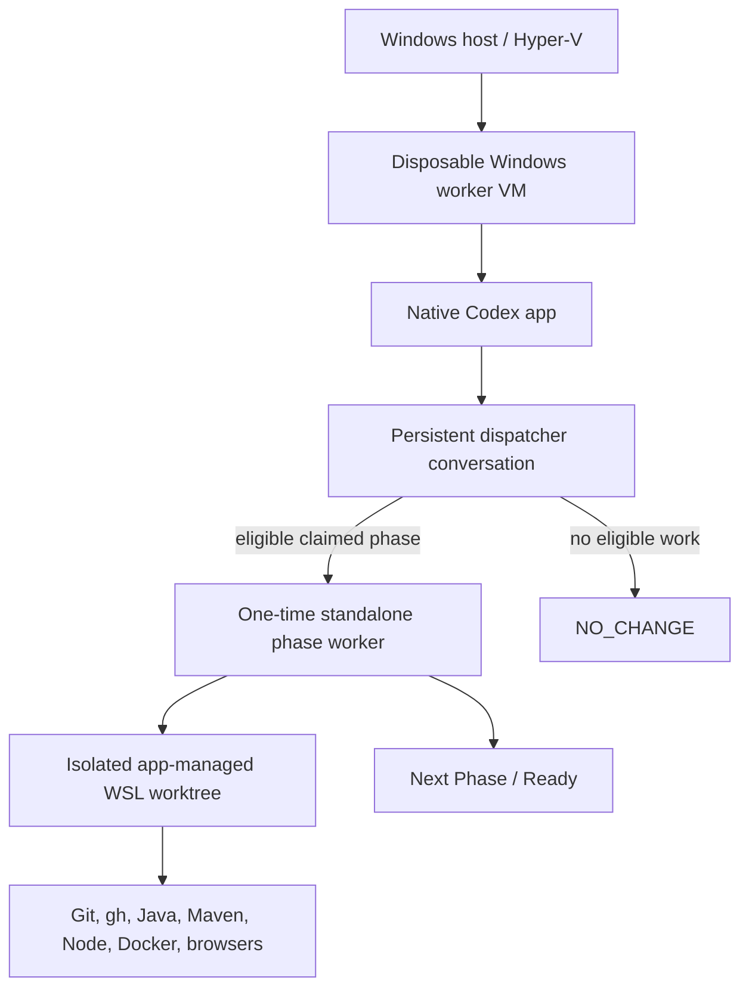

# App-native Local Codex on a Windows virtual machine

This runbook provisions the optional app-native Local Codex executor: the native Codex app runs in a disposable Windows VM,
while repository tools and app-managed worktrees run in WSL2. Use it when app-owned conversations, interactive steering, or
Remote visibility add value. For unattended Linux `systemd`/cron workers, use
[`docs/ai-delivery/executors/codex-local.md`](ai-delivery/executors/codex-local.md).

Shared lifecycle, routing, claim, supervision, and verification semantics live in [`docs/ai-delivery/`](ai-delivery/README.md).
This file covers only the Windows/WSL/app adapter.

## Architecture



Important boundaries:

- The dispatcher polls and claims only; it never edits source or reviews the worker's PR.
- One standalone worker owns one `Implementation` or `Verification` phase turn.
- Implementation hands off to `Review / Ready / ChatGPT`; it does not create its own reviewer/follow-up task.
- Verification hands off according to the outcome classification in
  [`verification.md`](ai-delivery/verification.md).
- Empty polls stay in the persistent dispatcher conversation and create no worktree.
- Nested child-task creation is feature-tested after app updates, never assumed.
- The complete Windows VM is the outer security boundary. Do not mount host files or add personal/employer credentials.
- No app task merges, enables auto-merge, rewrites shared history, or performs privileged operations without Dmitry's
  explicit instruction.

## Host and VM

The physical host needs a Windows edition with Hyper-V and hardware virtualization. Follow Microsoft's
[Hyper-V requirements](https://learn.microsoft.com/en-us/windows-server/virtualization/hyper-v/host-hardware-requirements#operating-system-requirements)
and [nested virtualization](https://learn.microsoft.com/en-us/windows-server/virtualization/hyper-v/enable-nested-virtualization)
guidance.

For the Ryzen 9 9900X / 64 GB host, start with:

| Resource | Worker VM |
| --- | ---: |
| Virtual processors | 12 |
| Static memory | 32 GB |
| Dynamically expanding system disk | 300 GB |
| Generation | 2 with Secure Boot and vTPM |
| Network | Hyper-V Default Switch |

Example elevated PowerShell setup:

```powershell
$vmName = "bedrin-worker-1"
$vmRoot = "C:\work\vms\$vmName"
$isoPath = "C:\work\iso\windows.iso"

New-Item -ItemType Directory -Force -Path $vmRoot
New-VM `
  -Name $vmName `
  -Generation 2 `
  -MemoryStartupBytes 32GB `
  -NewVHDPath "$vmRoot\system.vhdx" `
  -NewVHDSizeBytes 300GB `
  -SwitchName "Default Switch"
Set-VMProcessor -VMName $vmName -Count 12 -ExposeVirtualizationExtensions $true
Set-VMMemory -VMName $vmName -DynamicMemoryEnabled $false -StartupBytes 32GB
Set-VMFirmware -VMName $vmName -EnableSecureBoot On -SecureBootTemplate MicrosoftWindows
Set-VMKeyProtector -VMName $vmName -NewLocalKeyProtector
Enable-VMTPM -VMName $vmName
Set-VM -Name $vmName -AutomaticStartAction Start -AutomaticStopAction Save
$dvd = Add-VMDvdDrive -VMName $vmName -Path $isoPath -Passthru
Set-VMFirmware -VMName $vmName -FirstBootDevice $dvd
```

Install Windows with a dedicated low-value local account. Apply updates, disable guest sleep, and create a clean
pre-credential checkpoint. A permanent guest needs appropriate Windows licensing; do not use unofficial images or activation
bypasses.

## WSL2 and resources

Inside the VM, from elevated PowerShell:

```powershell
wsl --update
wsl --install -d Ubuntu-26.04
wsl --set-default-version 2
```

When needed, reserve resources in `%USERPROFILE%\.wslconfig`:

```ini
[wsl2]
memory=22GB
processors=10
swap=8GB
```

Apply with `wsl --shutdown`. The WSL limits are resource controls, not a security boundary.

## Codex app

1. Install the current native Windows app in the VM.
2. Configure the Codex agent and integrated terminal to use WSL2.
3. Add one app project for `~/src/sniffy/sniffy`; do not point a project at several repositories.
4. Keep the Windows account signed in and the app running for local automations.
5. Configure Remote only when mobile visibility is useful; it is optional for this architecture.

Codex app automations require the machine awake and the app running. See
[Codex automations](https://openai.com/academy/codex-automations/).

## WSL developer environment

Keep repositories under `~/src/<owner>/<repository>`. Install shared tools:

```bash
sudo apt-get update
sudo apt-get install -y \
  bash bubblewrap build-essential ca-certificates curl git jq tar unzip zip gh

curl https://mise.run | sh
echo 'eval "$(~/.local/bin/mise activate bash)"' >> ~/.bashrc
eval "$(~/.local/bin/mise activate bash)"
mise use --global node@24 maven@3.9
for version in 11 17 21 25; do mise install "java@${version}"; done
```

Install Docker Engine from Docker's official Ubuntu instructions. Docker-group membership is effectively root inside WSL and
is acceptable only in this disposable VM.

Bootstrap Sniffy:

```bash
mkdir -p ~/src/sniffy
cd ~/src/sniffy
git clone https://github.com/sniffy/sniffy.git
cd sniffy
git switch develop
bash .codex/cloud/setup.sh
(
  cd sniffy-ui
  npm ci
  npx playwright install --with-deps chromium firefox webkit
)
```

Use the same maintenance/bootstrap commands for new app-managed worktrees. Verify JDK 8 and the current development JDK with
`.codex/cloud/use-jdk.sh`.

## GitHub identity and protection

Use a dedicated organization member/machine account and short-lived fine-grained PAT limited to `sniffy/sniffy` with only the
required repository and Projects permissions. Grant Workflows write only for explicitly authorized workflow edits.

Authenticate from WSL without putting the token in a command argument or remote URL:

```bash
read -rsp "GitHub PAT: " github_pat && echo
printf '%s\n' "${github_pat}" | gh auth login --hostname github.com --git-protocol https --with-token
unset github_pat
gh auth setup-git --hostname github.com
gh auth status --hostname github.com
```

Configure a distinct commit identity. Protect `develop` with required pull requests and no force-push/deletion or automation
bypass. The implementation identity cannot formally review its own PR; Review normally routes to ChatGPT, with Dmitry as
formal reviewer when the PR author is `bedrin-gpt`.

## Permissions inside the VM

Full agent access is acceptable only because the VM is disposable and isolated:

```toml
approval_policy = "never"
sandbox_mode = "danger-full-access"
```

Preserve the outer controls:

- no host mounts, personal browser profile, cloud drives, password manager, or unrelated repositories;
- no organization administration, secret management, or broad package/workflow permissions;
- repository-scoped credentials and server-side branch protection;
- token rotation and rebuild after suspected compromise.

## App-native dispatcher and phase worker

Use the compatibility paths:

- [`.codex/local/scheduled-task-prompt.md`](../.codex/local/scheduled-task-prompt.md) — persistent dispatcher;
- [`.codex/local/worker-task-prompt.md`](../.codex/local/worker-task-prompt.md) — one-phase worker template.

The dispatcher selects only items matching:

```text
Status = Ready
Executor = Local Codex app
Phase = Implementation or Verification
Assignee is empty or matches the local worker identity
```

It follows the best-effort claim and lease protocol in [`event-loop.md`](ai-delivery/event-loop.md), then creates exactly one
one-time standalone worker with an isolated worktree. Failed child creation releases the claim or records an exact blocker.

Implementation workers publish exact branch/SHA/PR evidence and hand off to:

```text
Phase: Review
Status: Ready
Executor: ChatGPT
Assignee: bedrin-gpt
```

They do not schedule a self-review continuation. The shared Review event loop owns the next action. Verification workers use
the classification and handoffs embedded in the phase-worker template.

## Required smoke tests

Before enabling recurring dispatch, prove:

1. a manual read-only task runs inside WSL and sees the expected project;
2. an empty dispatcher tick stays in its conversation and creates no worktree;
3. one eligible item creates exactly one standalone phase worker and isolated worktree;
4. the child receives Phase, Implementer, Verifier, claim token, and generation;
5. concurrent claim attempts produce one winning worker;
6. failed child creation restores `Ready` or records an exact blocker;
7. Implementation hands off to `Review / Ready / ChatGPT` without self-review;
8. Verification produces the correct classified handoff;
9. no task can merge or enable auto-merge.

Repeat the child-task smoke test after material app/automation changes. If nested creation is unavailable, pause this adapter
and use a manual app worker or the headless Linux adapter. Do not substitute UI-click automation, external observers,
`codex app-server`, or nested `codex exec` without a separately approved design.

## Operations and recovery

- Update Windows, WSL, the app, Docker, `gh`, and toolchains in a defined maintenance window.
- Monitor VHDX/WSL disk, Maven/npm caches, Docker storage, and worktrees.
- Pause the dispatcher after unexpected claims, duplicates, publication mismatch, or repeated no-op errors.
- Before expiring a stale claim, inspect the worker reference, branch, PR, commits, and CI; do not infer inactivity from silence.
- Revoke credentials, disconnect Remote if configured, and rebuild after suspected compromise.
- Never restore an old credential-bearing checkpoint without rotating every secret in it.
