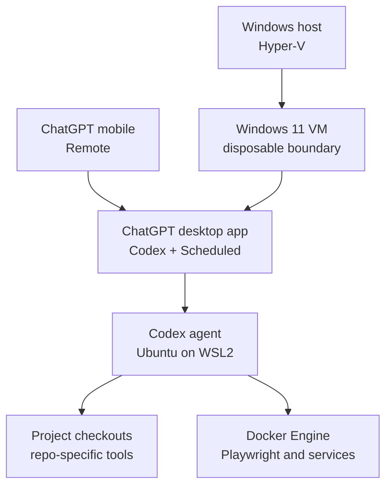

# Local Codex worker on a Windows virtual machine

This runbook describes an always-on local worker that can host Sniffy and other repositories, execute privileged,
long-running, or Docker-heavy tasks, and remain observable from the ChatGPT desktop and mobile apps. The security
boundary is a disposable Windows virtual machine; the Codex agent and developer toolchain run in WSL2 inside that VM.
Sniffy is the first concrete project configuration, not the boundary of the worker.

The design was last checked against the linked product documentation on 2026-07-17.

## 1. Architecture and decisions



The important choices are:

- Run the ChatGPT desktop app on Windows because the app supplies local projects, worktrees, Scheduled tasks, review
  UI, and [Remote connections](https://learn.chatgpt.com/docs/remote-connections) from mobile.
- Configure the app's Codex agent to run in WSL2. Local setup scripts then run in WSL, so Bash, `curl`, Linux Docker,
  and the existing repository scripts work without Cygwin.
- Treat the complete Windows VM as disposable and trusted by the agent. Full access inside the VM is acceptable only
  because the VM has no access to host files, host credentials, or repositories outside the explicitly registered
  worker portfolio.
- Install Docker Engine inside WSL2. Containers are tools available to Codex, not the outer isolation boundary.
- Use a dedicated GitHub identity and short-lived, owner- and repository-scoped credentials. GitHub branch rules
  remain the final write boundary.
- Use a ChatGPT desktop app Scheduled task as the dispatcher. A shell script can launch `codex exec`, but that is a CLI
  run rather than a supported way to inject a new local task into the app UI.

This worker complements Codex Cloud. Route ordinary clean, bounded tasks to Cloud and use this worker when persistent
artifacts, Docker, special networking, privileged tools, or long debugging sessions make a local environment preferable.

## 2. Host and VM prerequisites

### 2.1. Host

The physical Hyper-V host must run Windows 11 Pro, Enterprise, or another edition that includes the full Hyper-V
feature, as listed in Microsoft's [Hyper-V host requirements](https://learn.microsoft.com/en-us/windows-server/virtualization/hyper-v/host-hardware-requirements#operating-system-requirements).
This host requirement does not require the Windows guest to use the same edition. Enable AMD-V/SVM in UEFI and enable
Hyper-V from an elevated PowerShell session:

```powershell
Enable-WindowsOptionalFeature -Online -FeatureName Microsoft-Hyper-V -All
```

Restart the host and verify:

```powershell
systeminfo.exe
Get-WindowsOptionalFeature -Online -FeatureName Microsoft-Hyper-V-All
```

Microsoft supports nested virtualization on Windows 11 hosts with AMD Ryzen or later processors. The outer VM must use
configuration version 9.3 or later. See [Run Hyper-V in a virtual machine with nested
virtualization](https://learn.microsoft.com/en-us/windows-server/virtualization/hyper-v/enable-nested-virtualization).

### 2.2. Recommended allocation

For a Ryzen 9 9900X host with 64 GB RAM:

| Resource | Worker VM | Rationale |
| --- | ---: | --- |
| Virtual processors | 12 | Leaves half of the host's 24 logical processors available |
| Memory | 32 GB static | Enough for Windows, WSL, Maven, Docker, and browser tests without nested-memory resizing |
| System disk | 300 GB dynamically expanding | Room for Maven, npm, Docker layers, worktrees, and logs |
| VM generation | 2 | Required for Windows 11 Secure Boot and virtual TPM |
| Network | Hyper-V Default Switch initially | NAT outbound access without exposing host files |

These are starting values, not a compatibility contract. Static memory removes one source of nested-virtualization
surprises. Reduce Docker/WSL concurrency before assigning so much memory that the host starts paging.

### 2.3. Windows media and licensing

Choose the guest edition separately from the physical host edition:

| Guest option | WSL2 | Full Hyper-V role | Licensing use |
| --- | --- | --- | --- |
| Windows 11 Enterprise Evaluation | Yes | Yes | Free, licensed 90-day evaluation; best for proving the setup |
| Windows 11 Home | Yes | No | Smallest sufficient long-lived guest after assigning a valid Home license |
| Windows 11 Pro | Yes | Yes | Recommended here for RDP and easier administration after assigning a valid Pro license |

Windows 11 Home is technically sufficient for the worker guest. Microsoft explicitly supports WSL2 on
[Windows 11 Home](https://learn.microsoft.com/en-us/windows/wsl/faq#is-wsl-2-available-on-windows-10-home-and-windows-11-home).
WSL2 uses the **Virtual Machine Platform** subset of Hyper-V, which is available on all Windows desktop editions; it
does not require the guest to expose the complete Hyper-V management role. Microsoft also supports
[WSL2 inside a Hyper-V VM](https://learn.microsoft.com/en-us/windows-server/virtualization/hyper-v/nested-virtualization#run-wsl2-in-a-hyper-v-vm-running-nested-on-hyper-v)
when nested virtualization is enabled. The physical host still needs Pro or Enterprise because it creates and runs the
outer VM.

For the first build, either use the official
[Windows 11 Enterprise 90-day evaluation](https://www.microsoft.com/en-us/evalcenter/evaluate-windows-11-enterprise) or
download Microsoft's normal [multi-edition Windows 11 ISO](https://www.microsoft.com/en-us/software-download/windows11)
and install Pro. Home remains technically sufficient, but this runbook recommends Pro because accepting inbound RDP
and using its administration tools are useful when operating an unattended worker. Treat the evaluation as disposable
and plan to rebuild rather than assuming it can be converted in-place to Home or Pro later.

The normal installer allows **I don't have a product key**, but an unactivated Home or Pro installation is not a free
license. A host Windows license does not automatically license a second Windows instance in a VM. For a permanent
licensed guest, assign a separate valid license that permits that VM. See [Activate
Windows](https://support.microsoft.com/en-us/windows/activation/activate-windows) and the
[Windows license terms](https://www.microsoft.com/en-us/useterms). Do not use activation bypasses or unofficial KMS
services.

If Microsoft's ISO page returns message code `715-123130` or says that anonymous or location-hiding technology is not
allowed, retry from the normal unproxied connection without a VPN. On a Windows machine, the official **Create Windows
11 Installation Media** option on the same download page can create an ISO instead. Do not substitute an unofficial
mirror for a worker image that will hold credentials.

## 3. Create the Hyper-V VM

The Hyper-V Manager wizard is acceptable. The following PowerShell path makes the intended VM shape reproducible.

### 3.1. Save and run the creation script

Use the stable naming pattern `bedrin-worker-<number>`: the first VM and its Windows hostname are
`bedrin-worker-1`, and a later independent worker becomes `bedrin-worker-2`. Keep every worker under
`C:\work\vms\<vm-name>` and keep the reusable installation image at `C:\work\iso\windows.iso`.

Open **Windows PowerShell as Administrator** on the physical host. Create the VM storage directory and open the reusable
creation script in Notepad:

```powershell
New-Item -ItemType Directory -Force -Path "C:\work\vms"
notepad.exe "C:\work\vms\create-bedrin-worker.ps1"
```

Accept Notepad's prompt to create the file, paste the complete script below, and save and close Notepad. Starting
Notepad with the full `.ps1` path avoids accidentally saving `create-bedrin-worker.ps1.txt`.

```powershell
param(
  [ValidateRange(1, 99)]
  [int] $WorkerNumber = 1
)

$vmName = "bedrin-worker-$WorkerNumber"
$vmRoot = Join-Path "C:\work\vms" $vmName
$isoPath = "C:\work\iso\windows.iso"
$switchName = "Default Switch"

if (-not (Test-Path -LiteralPath $isoPath -PathType Leaf)) {
  throw "Windows ISO not found: $isoPath"
}

New-Item -ItemType Directory -Force -Path $vmRoot
New-VM `
  -Name $vmName `
  -Generation 2 `
  -MemoryStartupBytes 32GB `
  -NewVHDPath "$vmRoot\system.vhdx" `
  -NewVHDSizeBytes 300GB `
  -SwitchName $switchName

Set-VMProcessor -VMName $vmName -Count 12 -ExposeVirtualizationExtensions $true
Set-VMMemory -VMName $vmName -DynamicMemoryEnabled $false -StartupBytes 32GB
Set-VMFirmware -VMName $vmName -EnableSecureBoot On -SecureBootTemplate MicrosoftWindows
Set-VMKeyProtector -VMName $vmName -NewLocalKeyProtector
Enable-VMTPM -VMName $vmName
Set-VM -Name $vmName -AutomaticStartAction Start -AutomaticStopAction Save

$dvd = Add-VMDvdDrive -VMName $vmName -Path $isoPath -Passthru
Set-VMFirmware -VMName $vmName -FirstBootDevice $dvd
```

The script deliberately creates the VM without starting it. In the same elevated PowerShell window, allow scripts only
for that PowerShell process and execute the saved file:

```powershell
Set-ExecutionPolicy -Scope Process -ExecutionPolicy Bypass
& "C:\work\vms\create-bedrin-worker.ps1" -WorkerNumber 1
```

This creates `bedrin-worker-1` under `C:\work\vms\bedrin-worker-1`. To create the second worker later, run the
same script with `-WorkerNumber 2`; do not clone a credential-bearing first VM. The process-scoped override does not
weaken the permanent machine or user execution policy and disappears when the PowerShell window closes. Do not use a
machine-wide `Unrestricted` policy for this runbook.

Windows 11 VMs require Generation 2, Secure Boot, a virtual TPM, at least 4 GB RAM, two virtual processors, and 64 GB
storage. See [Windows 11 requirements: virtual machine
support](https://learn.microsoft.com/en-us/windows/whats-new/windows-11-requirements#virtual-machine-support).

### 3.2. Open Hyper-V Manager and boot the ISO

Open the manager from Start by searching for **Hyper-V Manager**, or run:

```powershell
virtmgmt.msc
```

In Hyper-V Manager:

1. Select the local host in the left pane. If it is absent, use **Action > Connect to Server > Local computer**.
2. Find **bedrin-worker-1** in the center **Virtual Machines** pane.
3. Right-click **bedrin-worker-1**, select **Connect**, and leave the VMConnect console in the foreground.
4. Click **Start** in VMConnect.
5. Immediately click inside the console and press **Space** repeatedly until Windows Setup appears.

An official Windows ISO briefly displays **Press any key to boot from CD or DVD**. One keypress is technically enough
after VMConnect has keyboard focus, but repeated Space presses are a reliable way to acquire focus and catch the
short prompt. If the Hyper-V UEFI boot summary appears instead, click **Restart now**, click inside the console, and
repeat the Space presses. On later installer-initiated reboots, do **not** press a key; let the VM boot from its virtual
disk instead of restarting setup from the ISO.

During Windows setup:

1. Select Windows 11 Pro, not a regional `N` edition. Home supports WSL2, but Pro makes later RDP and administration
   easier.
2. Give Windows the same device name as the Hyper-V VM: `bedrin-worker-1`. Use `bedrin-worker-2` for the later
   second worker.
3. To create a local account during Windows 11 Pro OOBE, choose **Set up for work or school**, then
   **Sign-in options > Domain join instead**. Despite the label, this path creates a local account and does not require
   joining a domain.
4. If that option is absent or OOBE has already passed it, finish setup with a dedicated temporary Microsoft account,
   then use **Settings > Accounts > Your info > Sign in with a local account instead**. Microsoft documents this
   conversion in [Change from a Microsoft account to a local
   account](https://support.microsoft.com/en-US/accounts-billing/manage/change-from-a-local-account-to-a-microsoft-account-in-windows).
   Remove the temporary identity from **Email & accounts** and unlink OneDrive afterward.
5. Use a dedicated local Windows username such as `worker` and set a strong non-empty password because RDP will need
   it. Do not use a personal or employer Microsoft account for this VM.
6. Do not sign into GitHub, email, cloud drives, or password managers used on the host.
7. Apply Windows Update and reboot until no important update remains.
8. Disable sleep inside the guest. The host may still save the VM during shutdown.
9. Do not enable shared host drives. Avoid clipboard and device redirection when using an enhanced session.
10. Create a clean checkpoint before adding ChatGPT and GitHub credentials.

Checkpoints and VM exports made after login contain cached credentials. Store them only on an encrypted host volume and
treat them as secrets.

## 4. Install and constrain WSL2

In an elevated PowerShell terminal inside the Windows VM, update WSL, confirm that the explicitly versioned
distribution is available, and install Ubuntu 26.04 LTS:

```powershell
wsl --update
wsl --list --online
wsl --install -d Ubuntu-26.04
wsl --set-default-version 2
```

If the Microsoft Store path fails but `Ubuntu-26.04` appears in the online list, retry the install using WSL's web
download path:

```powershell
wsl --install --web-download -d Ubuntu-26.04
```

Do not use the floating `Ubuntu` name in provisioning: an explicit distribution name keeps later workers on the same
release. Microsoft documents the distribution list, named installs, and `--web-download` fallback in
[Install WSL](https://learn.microsoft.com/en-us/windows/wsl/install). Restart Windows, finish the Ubuntu user setup,
and verify that the distribution is version 2:

```powershell
wsl --status
wsl --list --verbose
```

If WSL reports that virtualization is unavailable, stop the VM and re-run this command on the physical host:

```powershell
Set-VMProcessor -VMName "bedrin-worker-1" -ExposeVirtualizationExtensions $true
```

Running WSL2 inside a Hyper-V VM is a supported nested-virtualization scenario. See Microsoft's
[nested virtualization overview](https://learn.microsoft.com/en-us/windows-server/virtualization/hyper-v/nested-virtualization#run-wsl2-in-a-hyper-v-vm-running-nested-on-hyper-v).

Optionally constrain the nested WSL VM in `%USERPROFILE%\.wslconfig` so that Windows retains resources for the desktop
app:

```ini
[wsl2]
memory=22GB
processors=10
swap=8GB
```

Apply changes with:

```powershell
wsl --shutdown
```

The outer Hyper-V VM remains the security boundary; `.wslconfig` is resource control, not security isolation.

## 5. Install the ChatGPT desktop app and Remote

Install the current Windows app inside the VM:

```powershell
winget install --id 9PLM9XGG6VKS -s msstore
```

Then:

1. Sign in to the ChatGPT desktop app using the same ChatGPT account and workspace as the mobile app.
2. Open **Settings**, switch the Codex agent from Windows native to **WSL**, and restart the app. The restart is required.
3. Set WSL as the integrated terminal unless PowerShell is specifically needed.
4. Add Sniffy from `\\wsl$\Ubuntu-26.04\home\<worker>\src\sniffy\sniffy` as the first local project.
5. Add every later repository as a separate local project; do not point one app project at a directory containing
   multiple repositories.
6. Select **Set up Remote** in the sidebar and pair the phone using the displayed QR code.
7. Enable launch at login and keep the Windows session signed in. Keep it unlocked when a task uses Computer Use.

The current Windows app and WSL behavior are documented in [ChatGPT desktop app for
Windows](https://learn.chatgpt.com/docs/windows/windows-app). Remote setup and host availability are documented in
[Remote connections](https://learn.chatgpt.com/docs/remote-connections).

For an unattended machine, decide explicitly how reboots are handled:

- **Supervised default:** log in manually after Windows Update or a host restart, then start the app.
- **Always-on:** use a dedicated low-value local account with automatic login and app startup. This improves recovery
  but stores a reusable Windows login secret inside the VM; it does not remove the need for least-privilege PATs.

## 6. Provision the WSL developer environment

Run all project tooling inside Ubuntu, not in native Windows. This avoids duplicate Git checkouts, path translation,
file-watcher problems, and mixed Windows/Linux credentials. Use `~/src/<owner>/<repository>` so repositories with the
same name cannot collide.

### 6.1. Base packages and shared toolchain

Use `apt` only for operating-system packages. Keep language and build-tool versions in `mise` so the same worker can
host repositories with different requirements:

```bash
sudo apt-get update
sudo apt-get install -y \
  bash bubblewrap build-essential ca-certificates curl git jq tar unzip zip gh
```

Install [`mise`](https://mise.jdx.dev/getting-started.html), activate it for Bash, and activate it in the current shell:

```bash
curl https://mise.run | sh
echo 'eval "$(~/.local/bin/mise activate bash)"' >> ~/.bashrc
eval "$(~/.local/bin/mise activate bash)"
mise --version
```

Sniffy's frontend declares Node.js 24 or newer. Install Node 24 and the Maven 3.9 release line as machine defaults, then
install the additional JDKs expected by the existing Sniffy scripts:

```bash
mise use --global node@24 maven@3.9

for version in 11 17 21 25; do
  mise install "java@${version}"
done
```

Node includes `npm`; do not separately install Ubuntu's `nodejs` or `npm` packages. Do not use global npm installs such
as `sudo npm install -g ...` for repository tools. Maven is machine-managed only until the repository adds a Maven Wrapper
or pins it in a project `mise.toml`. A repository-level tool declaration must take precedence over these worker defaults.

Verify the shared commands:

```bash
node --version
npm --version
mvn --version
mise ls
```

The repository setup script installs Temurin JDK 8 itself. `bubblewrap` is required if the app is later switched back
from full access to the Linux sandbox. See the `mise`
[Node.js documentation](https://mise.jdx.dev/lang/node.html) for version selection and npm behavior.

### 6.2. Docker Engine

Install Docker Engine inside Ubuntu using the official [Docker Engine for Ubuntu
instructions](https://docs.docker.com/engine/install/ubuntu/). Enable the service and allow the dedicated worker user to
use the Docker socket:

```bash
systemctl is-system-running
```

If WSL does not have systemd enabled, enable it through `/etc/wsl.conf` using Microsoft's
[WSL systemd instructions](https://learn.microsoft.com/en-us/windows/wsl/systemd), run `wsl --shutdown` from
PowerShell, and reopen Ubuntu. Then continue:

```bash
sudo systemctl enable --now docker
sudo usermod -aG docker "$USER"
```

Exit all WSL shells, run `wsl --shutdown` from PowerShell, reopen Ubuntu, and verify:

```bash
docker version
docker run --rm hello-world
```

Membership in the `docker` group is effectively root access inside WSL. That is intentional only because the whole VM
is dedicated to the worker. Docker Desktop is not required.

### 6.3. Clone and bootstrap Sniffy as the first project

```bash
mkdir -p ~/src/sniffy
cd ~/src/sniffy
git clone https://github.com/sniffy/sniffy.git
cd sniffy
git switch develop
```

On a clean Ubuntu installation, `.codex/cloud/setup.sh` cannot be the very first command: it assumes `curl`, Git,
Maven, `mise`, and JDK 11/17/21/25 are already available in the Codex universal image. After the bootstrap above, run:

```bash
bash .codex/cloud/setup.sh
```

Install the exact frontend dependency tree from the committed lockfile, then use that project-local Playwright CLI to
install all browser engines used by `sniffy-ui/playwright.config.ts` plus their Ubuntu libraries:

```bash
cd sniffy-ui
npm ci
npx playwright install --with-deps chromium firefox webkit
npx playwright --version
cd ..
```

Do not install `@playwright/test` or Playwright globally. The repository pins its Playwright package in
`package-lock.json`, and every Playwright version expects matching browser binaries. `npx playwright` resolves the
local CLI after `npm ci`; the downloaded browsers are shared across this WSL user's worktrees through Playwright's
default Linux cache at `~/.cache/ms-playwright`. Re-run the `--with-deps` command after a Playwright upgrade or a
fresh WSL installation. See Playwright's [browser installation
documentation](https://playwright.dev/docs/browsers).

This compatibility path reuses the existing JDK 8 installation, toolchain generation, GitHub CLI installation,
environment file, and Maven cache warm-up. Verify both ends of the supported matrix:

```bash
source .codex/cloud/use-jdk.sh 8
mvn -version

source .codex/cloud/use-jdk.sh 25
mvn -version
```

In the app's [local environment](https://learn.chatgpt.com/docs/environments/local-environment), use this setup command
for new worktrees after the one-time machine bootstrap:

```bash
bash .codex/cloud/maintenance.sh
(
  cd sniffy-ui
  npm ci
  npx playwright install chromium firefox webkit
)
```

The worktree setup intentionally omits `--with-deps`: Ubuntu browser libraries were installed once during machine
bootstrap, while this idempotent command ensures browser binaries matching the worktree's locked Playwright version are
present. If a Playwright upgrade requires new Ubuntu libraries, repeat the one-time `--with-deps` command manually.

Local environment setup scripts execute in WSL when the app agent uses WSL. Configure the environment through the app
and commit the generated `.codex` configuration only after it has been tested on a second clean worktree.

### 6.4. Portable environment direction

There is no single industry-standard file that installs Windows features, Ubuntu packages, language runtimes, Docker,
and project dependencies across every platform. Keep the layers explicit:

| Layer | Recommended source of truth |
| --- | --- |
| VM and Windows features | Hyper-V PowerShell/runbook, later an idempotent provisioning script |
| OS packages | `winget` for Windows-only apps; `apt` for the WSL distribution |
| Java/Node/Python versions | Repository `mise.toml` in a follow-up change |
| Maven version and invocation | Maven Wrapper plus `pom.xml` |
| Codex worktree setup/actions | App local environment configuration under `.codex` |
| Agent conventions and checks | `AGENTS.md` |
| Optional editor/container environment | Development Container specification |

The next portability improvement should extract cloud-image assumptions from `.codex/cloud/setup.sh` into a shared,
idempotent Linux toolchain script and add a small WSL bootstrap. A `mise.toml` and Maven Wrapper would make versions
declarative. Keep Dev Containers as an optional reproducible development target, not as the outer boundary for this
worker.

Do not install Cygwin. WSL2 already supplies the Linux system that Bash scripts, `curl`, Docker, and Playwright expect.
Git Bash may remain useful for an occasional native-Windows terminal, but the worker should not depend on it.

## 7. GitHub identity and least privilege

Prefer a dedicated machine account that is a member of the `sniffy` organization. Create a fine-grained PAT with:

- resource owner `sniffy`;
- repository access limited to `sniffy/sniffy`;
- repository permissions: Metadata read, Contents read/write, Issues read/write, and Pull requests read/write;
- organization permission: Projects read/write for the organization-owned book of work;
- Workflows read/write only when authorized tasks may change `.github/workflows/`;
- a short expiration and an explicit rotation reminder.

GitHub documents both the [fine-grained PAT limitations](https://docs.github.com/en/authentication/keeping-your-account-and-data-secure/managing-your-personal-access-tokens#fine-grained-personal-access-tokens)
and the organization-level [Projects permission](https://docs.github.com/en/rest/projects/projects). Fine-grained PATs do
not support user-owned Projects, so keep the worker's book of work owned by the `sniffy` organization.

Authenticate from WSL without putting the token in a command argument or Git remote URL:

```bash
read -rsp "GitHub PAT: " github_pat && echo
printf '%s\n' "${github_pat}" | gh auth login --hostname github.com --git-protocol https --with-token
unset github_pat
gh auth setup-git --hostname github.com
gh auth status --hostname github.com
```

Configure a distinct commit identity:

```bash
git config --global user.name "Sniffy Codex Worker"
git config --global user.email "<machine-account-noreply-address>"
```

Validate effective access instead of trusting the token settings page:

```bash
gh repo view sniffy/sniffy
gh project list --owner sniffy
git ls-remote https://github.com/sniffy/sniffy.git refs/heads/develop
```

The `gh project` command documents `project` as the minimum classic-token scope. For a fine-grained token, the equivalent
is the organization Projects permission. If the project commands fail, fix that one permission rather than replacing
the token with an unrestricted classic PAT.

Protect `develop` with a server-side ruleset requiring pull requests and disallowing force pushes and deletion. The
machine account must not bypass the ruleset.

## 8. Codex permissions inside the VM

Use the app's permission selector to set **Full access** for this worker. The equivalent local Codex defaults are:

```toml
approval_policy = "never"
sandbox_mode = "danger-full-access"
```

The Windows app stores its configuration under `%USERPROFILE%\.codex`. Configure it in the app or through **Settings >
Configuration**; do not copy this full-access configuration to a normal workstation. The app, CLI, and IDE share
configuration layers, while a separate CLI installed inside WSL uses the WSL home directory unless `CODEX_HOME` is
explicitly shared.

Full access removes the inner Codex sandbox. It does not bypass Windows/Hyper-V, the dedicated GitHub token, or GitHub
branch protection. Preserve those outer controls:

- no host filesystem mounts or unrelated credentials;
- no personal browser profile inside the VM;
- no PAT with organization administration, secrets, packages, or workflow permission unless required;
- no force push, merge, or branch-rule bypass;
- no unreviewed VM snapshot restore after token rotation.

## 9. App-native task dispatch

### 9.1. Why Scheduled tasks are the dispatcher

The supported app-native path is a [Scheduled task](https://learn.chatgpt.com/docs/automations) scoped to one or more
local app projects. A run can use a dedicated background worktree, appears in the app's **Scheduled** inbox, and remains
visible through Remote while the machine and desktop app are running. Use separate Scheduled tasks by default when
repositories have different prompts, queues, schedules, or credential owners. The app also supports assigning one
generic Scheduled task to several projects when their workflow is truly identical.

There is currently no documented stable shell API that creates a new local task inside the ChatGPT desktop app UI.
`codex exec` and `.codex/local/run-issue.sh` remain useful CLI fallbacks, but a CLI run is not the same app task. The
experimental `codex app-server` is intended for development/debugging and should not be the production dispatcher.

Therefore:

1. Create one Scheduled task in the ChatGPT desktop app.
2. Attach it to the local Sniffy project.
3. Select a dedicated background worktree.
4. Start with a conservative interval such as every 30 minutes.
5. Let each run claim at most one issue.
6. Keep the VM powered on, the Windows account signed in, and the app running.

Scheduled tasks run unattended and use the default sandbox settings. Full access is intentional here only because the
VM is disposable and isolated.

### 9.2. Claim contract

The GitHub Project is the source of truth. An eligible item must:

- be an Issue in `sniffy/sniffy`, not a draft item or pull request;
- have project Status `Ready for agent` and Executor `Local Codex`;
- satisfy the Definition of Ready in `docs/codex-workflow.md`;
- be either:
  - **fresh work** with no active local-worker claim and no implementation pull request; or
  - an explicitly re-queued **continuation** with an existing local-worker claim, writable branch, and open
    implementation pull request that has actionable maintainer feedback or failing required checks;
- not require a product decision or permission absent from the worker token.

For continuation work, `Ready for agent` is an explicit lease renewal. Historical claim comments, the existing
`agent/issue-N` branch, and the open pull request are required context rather than disqualifiers. An item whose
Status is still `In progress` or `Review` is not eligible for another Scheduled run, which prevents two worker
cycles from editing the same branch concurrently.

For one worker, this claim sequence is sufficient:

1. List at most 100 matching items. Prefer an explicitly re-queued continuation so review loops close before new
   work starts, then choose deterministically by project Priority and oldest issue number.
2. Re-read the selected issue, all comments, project fields, linked pull requests, review threads, and current CI
   immediately before claiming.
3. Classify the item as fresh work or a continuation. For a continuation, verify that the existing pull request is
   open, its head branch is writable by the worker, and the latest maintainer instructions identify actionable
   fixes or required failed checks. Classify a failed npm audit before expanding scope: if the published diff does not
   change a dependency input defined by `docs/dependency-security.md`, preserve the feature PR, link a separate
   remediation issue, and treat the failure as repository-health/policy work unless the maintainer explicitly re-queues
   that separate concern.
4. Set Status to `In progress`.
5. Add the machine account as assignee and add `agent:local` when missing.
6. For fresh work, post a claim comment containing the worker name, intended `agent/issue-N` branch, timestamp,
   and Scheduled run link when available. For a continuation, post a continuation-claim comment containing the
   existing branch, pull request, current head SHA, timestamp, and feedback scope.
7. If any claim mutation fails, undo mutations that succeeded and stop without editing code.

Useful discovery commands are:

```bash
project_number="<ORGANIZATION_PROJECT_NUMBER>"

gh project view "${project_number}" --owner sniffy --format json
gh project field-list "${project_number}" --owner sniffy --format json
gh project item-list "${project_number}" \
  --owner sniffy \
  --query 'repo:sniffy/sniffy status:"Ready for agent"' \
  --limit 100 \
  --format json
```

To update the single-select Status field, resolve the project ID, item ID, Status field ID, and target option ID from
the JSON above, then run:

```bash
gh project item-edit \
  --id "${item_id}" \
  --project-id "${project_id}" \
  --field-id "${status_field_id}" \
  --single-select-option-id "${in_progress_local_option_id}"
```

The command shapes are documented in the GitHub CLI manuals for
[`gh project item-list`](https://cli.github.com/manual/gh_project_item-list),
[`gh project field-list`](https://cli.github.com/manual/gh_project_field-list), and
[`gh project item-edit`](https://cli.github.com/manual/gh_project_item-edit).

GitHub Projects field updates do not provide a compare-and-swap claim primitive. Do not run multiple workers against
this simple protocol. Before adding a second worker, introduce a single coordinator or another atomic lease mechanism.

### 9.3. Scheduled task prompt

Use [`.codex/local/scheduled-task-prompt.md`](../.codex/local/scheduled-task-prompt.md) as the single canonical prompt.
Replace the project number if necessary, copy that file's prompt text into the ChatGPT Scheduled task, and test it
manually before enabling the schedule.

The worker performs the issue directly in the Scheduled task. It must not call `.codex/local/run-issue.sh`, because that
would launch a second, nested CLI agent and lose the app-native task lifecycle.

## 10. Add repositories and organizations

### 10.1. Keep one real trust boundary

One VM may host several personal or open-source repositories when all of them belong to the same trust domain. Full
access means a task running for one repository can technically read every checkout and credential profile in the VM.
Separate WSL users, distributions, and `GH_CONFIG_DIR` values improve organization but are not security boundaries
against the full-access agent.

Use another outer VM for corporate repositories, client work, unknown third-party code, or any organization that must
not share credentials with the personal worker. Do not put employer credentials in this VM.

Use this checkout layout inside the shared WSL distribution:

```text
~/src/
  sniffy/sniffy/
  nefi/nefi/
  kerb4j/kerb4j/
```

### 10.2. Create one app project per repository

For each additional repository:

1. Clone it into `~/src/<owner>/<repository>`.
2. Add that checkout root as a separate local project in the ChatGPT desktop app.
3. Add repository-specific `AGENTS.md`, setup, test, base-branch, and Definition-of-Ready instructions.
4. Configure and smoke-test its local worktree environment.
5. Copy the Scheduled task prompt and substitute the repository's values, or attach a tested generic task shared by
   projects with the same queue contract.
6. Run one manual no-op cycle and one disposable issue end to end before enabling its schedule.
7. Stagger schedules so Maven, Docker, browsers, and multiple worktree setups do not all start together.

A Scheduled task may be assigned to more than one local project, but each run must stay inside the project and worktree
selected by the app. The generic prompt must derive repository-specific values from that checkout. Do not claim an
arbitrary repository and then clone or change directory into it: that loses the clean lifecycle and makes mobile review
misleading.

An organization-owned GitHub Project may contain issues from several repositories in that organization. Give every
repository its own app project and retain the `repo:<owner>/<repository>` query filter whether the schedule is shared
or separate. The runs can share status names and the same Project number while always claiming only their own
repository.

Record these values for every project instead of hard-coding Sniffy assumptions into a common machine script:

| Setting | Sniffy example | Per-project value |
| --- | --- | --- |
| Checkout | `~/src/sniffy/sniffy` | `~/src/<owner>/<repository>` |
| GitHub repository | `sniffy/sniffy` | `<owner>/<repository>` |
| Queue owner | `sniffy` | Organization that owns the Project |
| Project number | `<PROJECT_NUMBER>` | Organization Project number |
| Base branch | `develop` | Repository integration branch |
| Readiness contract | `docs/codex-workflow.md` | Repository-owned instructions |
| Worktree setup | `.codex/cloud/maintenance.sh` | Repository-owned local setup |
| Ready/in-progress/review states | Sniffy Project options | Queue-specific option IDs and names |
| Worker label and assignee | `agent:local`, machine account | Repository-specific values |

Machine provisioning installs only shared capabilities such as WSL, Docker, Git, `gh`, `mise`, and common language
runtimes. Each repository remains responsible for exact versions, setup commands, tests, and agent guidance.

### 10.3. Scope credentials by resource owner

A fine-grained PAT can access repositories owned by only
[one user or organization](https://docs.github.com/en/authentication/keeping-your-account-and-data-secure/managing-your-personal-access-tokens#fine-grained-personal-access-tokens).
Choose the credential layout from the actual ownership boundaries:

| Repository portfolio | Recommended credential model |
| --- | --- |
| Several repositories in one organization | One dedicated machine account and one fine-grained PAT limited to selected repositories |
| Repositories in several personal organizations | One fine-grained PAT and one `gh` profile per resource owner |
| Many organizations or automated token rotation | A narrowly permissioned GitHub App installed only on selected repositories |
| Different security or legal trust domains | Separate outer worker VMs and separate identities |

Do not solve the multi-organization limitation by issuing one broad classic PAT. Store each owner profile outside every
checkout, select it explicitly for that project's `gh` and Git commands, and test repository plus Project access before
enabling the schedule. `GH_CONFIG_DIR` can keep the `gh` profiles separate, but the full-access agent can still read
all profiles in the same VM; the separation prevents accidental credential selection, not deliberate cross-access.

For a small hobby portfolio, start with one fine-grained PAT per owner. Move to a GitHub App only when installation
tokens, centralized permission management, or rotation justify the additional bootstrap code.

### 10.4. Parameterize the queue contract, not the VM

Keep the Sniffy prompt in section 9 as a working example. A new repository changes the prompt values and repository
instructions, not the Windows image. At minimum parameterize:

```text
OWNER
REPOSITORY
PROJECT_NUMBER
BASE_BRANCH
READINESS_DOCUMENT
READY_STATUS
IN_PROGRESS_STATUS
REVIEW_STATUS
BLOCKED_STATUS
WORKER_ASSIGNEE
WORKER_LABEL
```

Keep each organization's book of work in an organization-owned Project for the initial implementation. For multiple
organizations, run the corresponding repository tasks against their owner's Project and credential profile. A future
central coordinator may present a unified portfolio view, but it must not replace the app's per-repository task and
worktree boundary.

## 11. Validation checklist

### 11.1. VM and WSL

From the physical host:

```powershell
Get-VM -Name "bedrin-worker-1"
Get-VMProcessor -VMName "bedrin-worker-1" | Format-List Count,ExposeVirtualizationExtensions
Get-VMMemory -VMName "bedrin-worker-1"
Get-VMTPM -VMName "bedrin-worker-1"
```

Inside the Windows VM and WSL:

```powershell
wsl --status
wsl --list --verbose
```

```bash
git --version
gh --version
docker version
mise --version
node --version
npm --version
mvn -version
```

### 11.2. Repository toolchains

```bash
cd ~/src/sniffy/sniffy

source .codex/cloud/use-jdk.sh 8
mvn -version

source .codex/cloud/use-jdk.sh 25
mvn -version

cd sniffy-ui
npm ci
npx playwright --version
npx playwright install --list
npm run test:e2e
cd ..

git diff --check
```

Run one small focused Maven test and one Docker smoke test. Do not treat a cache warm-up as proof that the full reactor
passes.

### 11.3. GitHub publication

First run the reversible remote-ref validation prompt from `docs/codex-workflow.md`. Verify that the PAT can also read
and update the organization Project. Delete the probe branch and confirm that no remote ref remains.

### 11.4. App, Scheduled, and mobile

1. Start a manual read-only task in the local WSL project and confirm commands execute in Linux.
2. Create a disposable worktree task and confirm the local environment setup completes.
3. Pair Remote and inspect the running task, diff, and terminal output from the mobile app.
4. Run the worker prompt manually against a project view with no eligible issues; it must produce a no-op.
5. Add one disposable ready issue, run the task once, and verify claim fields, branch, PR, and `Review` transition.
6. Revoke or rotate the test PAT and confirm the old token no longer authenticates.
7. For each additional repository, verify that its Scheduled task cannot claim an issue for another repository.
8. For each additional resource owner, verify the selected credential profile can access only its intended repositories
   and Project.

Do not enable a recurring schedule until all applicable checks pass.

## 12. Operations and recovery

- Keep Windows, WSL, the ChatGPT desktop app, Docker, `gh`, and toolchains updated during a defined maintenance window.
- Review the first several Scheduled runs. Pause the schedule after unexpected claims, repeated no-op errors, or a
  publication mismatch.
- Archive old Scheduled runs so their background worktrees can be cleaned up.
- Monitor free disk space in the outer VHDX, the WSL virtual disk, Maven cache, Docker storage, and Git worktrees.
- Reboot and revalidate after changes to Hyper-V, WSL, Docker, app agent mode, PAT permissions, or `.codex` setup files.
- On suspected compromise: stop the VM, revoke the PAT, disconnect Remote, invalidate active ChatGPT sessions if needed,
  and rebuild from the pre-credential checkpoint or clean media.
- Do not restore an old credential-bearing checkpoint after revocation without rotating every secret it contains.
- When an Enterprise Evaluation approaches expiry, rebuild or assign an appropriate licensed guest. A Home guest does
  not expire after activation, but it still needs its own valid license. Activation bypass is not part of this design.

## 13. Explicit non-goals

- This runbook does not make unactivated Windows a licensed permanent installation.
- It does not expose the physical host filesystem or Docker daemon to Codex.
- It does not use Cygwin as a compatibility layer.
- It does not require Docker Desktop or a Dev Container to contain the agent.
- It does not use UI automation to click through the ChatGPT desktop app.
- It does not make a multi-worker GitHub Project claim protocol safe.
- It does not authorize the worker to merge pull requests, bypass branch rules, or manage repositories outside the
  explicitly registered portfolio.
