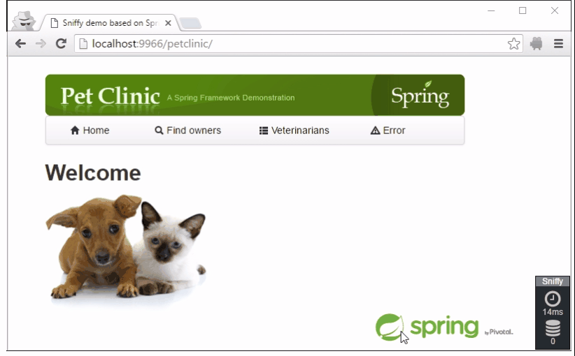

:imagesdir: ./images

= Sniffy

== Overview

Sniffy is a Java profiler which shows the results directly in your browser.
It also brings profiling to your unit (or rather component) tests and allows you to disable certain outgoing connections for fault-tolerance testing.

=== In-browser profiler



=== Asserting number of queries in unit tests

```java
include::../../../../sniffy-test/sniffy-junit/src/test/java/io/sniffy/test/junit/usage/JUnitOverviewTest.java[tags=JUnitOverview]
```

=== Testing bad connectivity

Discover all outgoing network connections from your server and disable them right from your browser:

image::network-connections.png[]

Sniffy will throw a `java.net.ConnectException` when your application tries to connect to address disallowed by Sniffy.

=== Simulating no connectivity in unit tests

```java
include::../../../../sniffy-test/sniffy-junit/src/test/java/io/sniffy/test/junit/usage/DisableConnectivityOverviewTest.java[tags=DisableSocketsOverview]
```

= Install

include::install.adoc[]

= Setup

include::setup-spring.adoc[]

include::setup-datasource.adoc[]

include::setup-filter.adoc[]

include::setup-containers.adoc[]

= Configuration

include::configuration.adoc[]

= Unit and component tests

include::test-api.adoc[]

include::test-junit.adoc[]

include::test-spring.adoc[]

include::test-testng.adoc[]

include::test-spock.adoc[]

= Migration from previous versions

include::migration-to-3.1.adoc[]